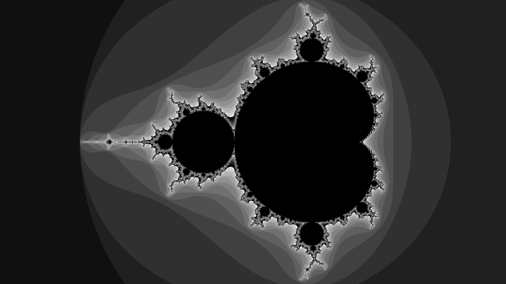

# frac
### A multithreaded, antialiased, and colored mandelbrot set generator


## installation
`go install github.com/skovati/frac`

or

```
git clone github.com/skovati/frac
cd frac
make install
```

## usage
```
frac --help
Usage of frac:
  --height int
    	Output image height (default 6000)
  --iter int
    	Number of mandelbrot iterations per pixel (default 255)
  --output string
    	File name to store rendered image in (default "frac.png")
  --size float
    	Size of area in complex plane to render (default 2.3)
  --width int
    	Output image width (default 8000)
  --xpos float
    	Real value of centered point (default -0.6)
  --ypos float
    	Imaginary value of centered point
```
